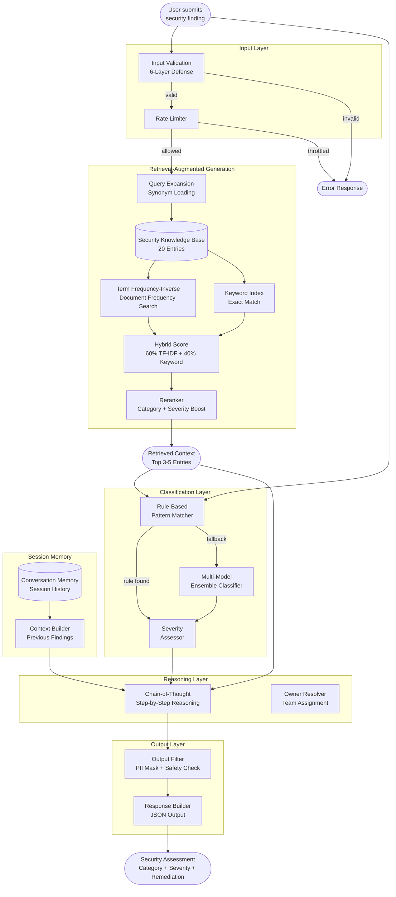
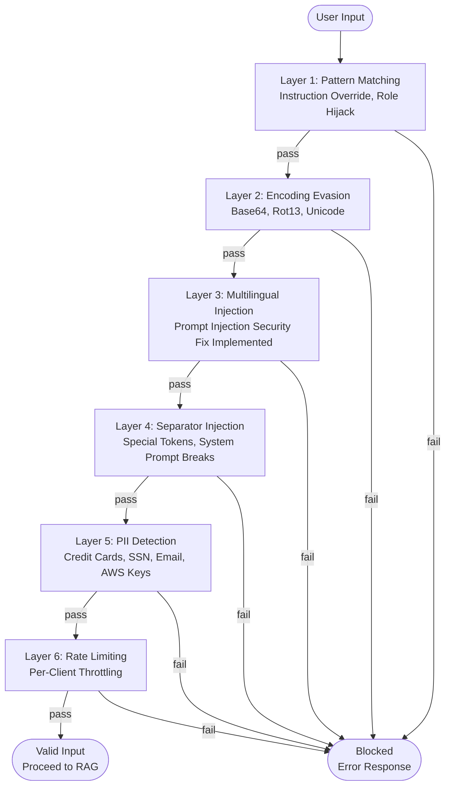
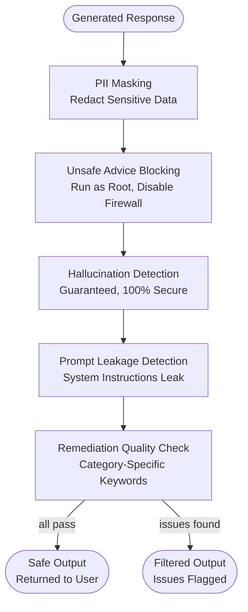
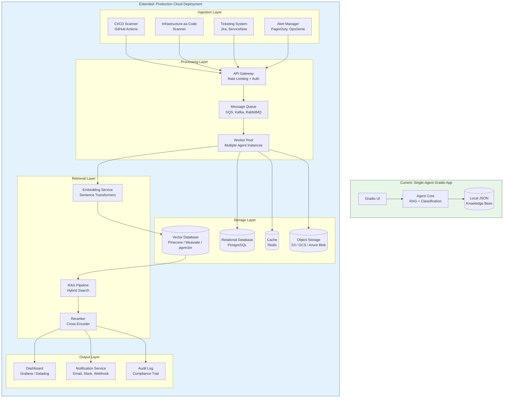
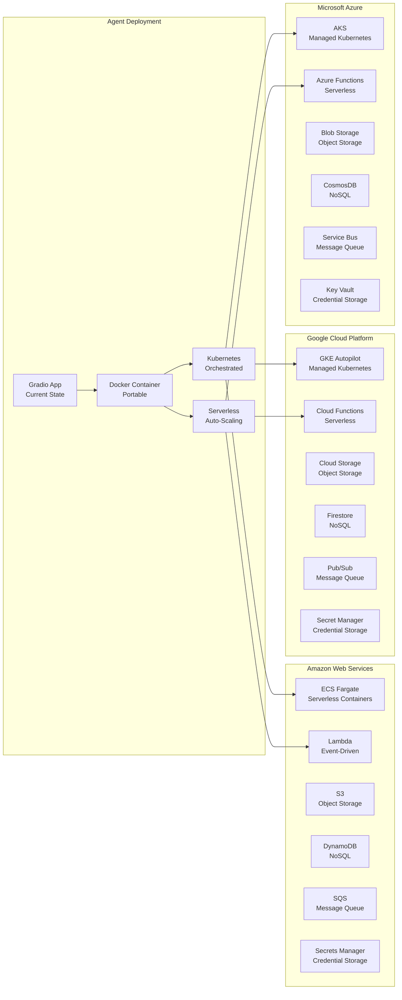
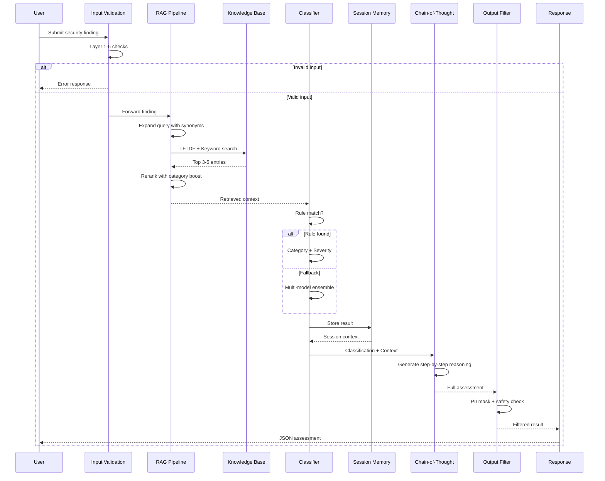
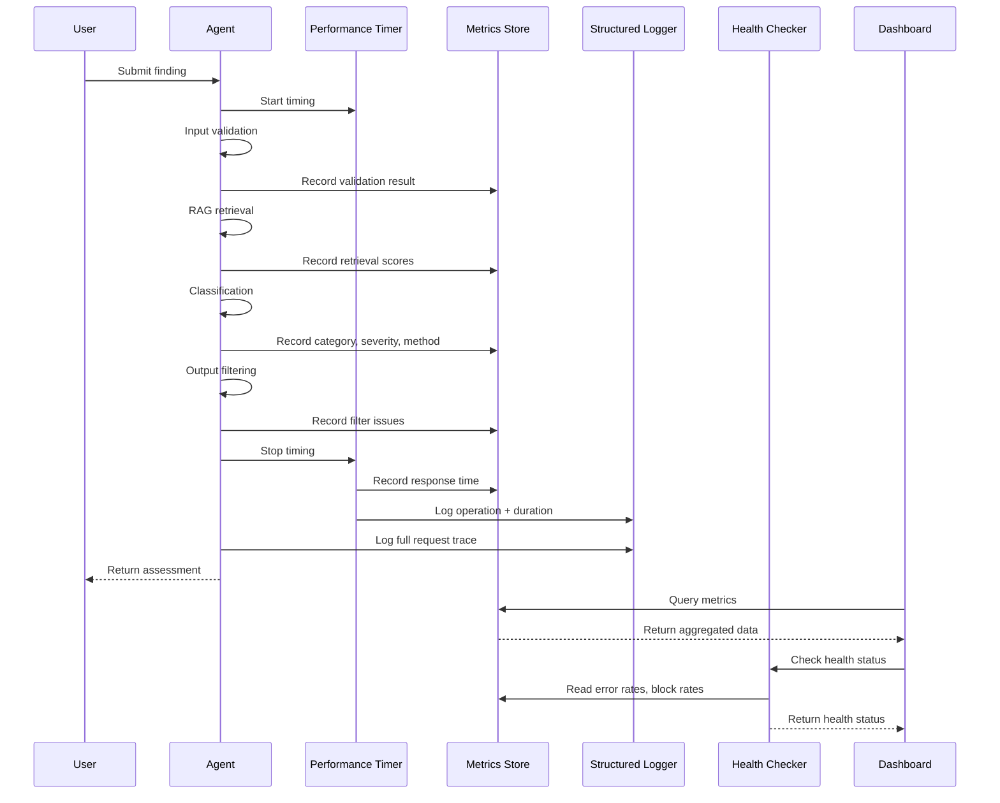
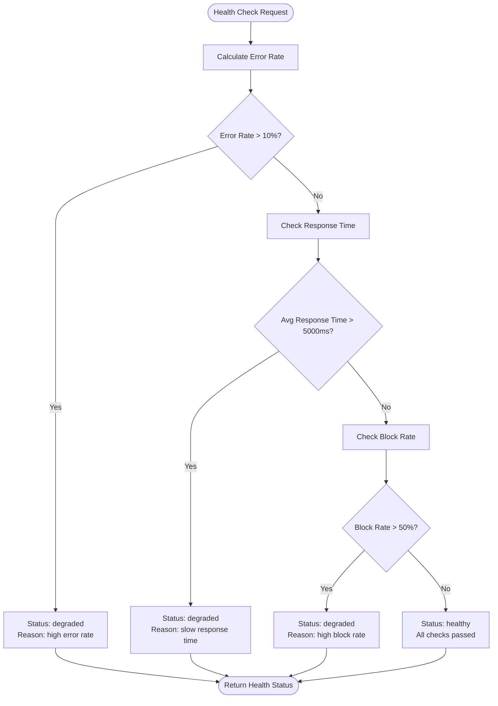

# Platform Engineering DevSecOps Advisor

A lightweight AI-assisted advisor that helps Platform Engineering and Site Reliability Engineering (SRE) teams turn infrastructure security findings into consistent, actionable remediation guidance.

The application accepts a finding, classifies it across common platform-security domains, assigns a severity, recommends a remediation path, and identifies the responsible platform team. It is advisory only: it does not modify infrastructure, deploy changes, or make access-control decisions.

## Live Deployment

Run the advisor in Hugging Face Spaces: [platform-eng-agent-advisor](https://huggingface.co/spaces/Tukue/platform-eng-agent-advisor).

## Business Need

Modern engineering organizations operate across cloud infrastructure, Kubernetes, CI/CD systems, identity platforms, and data services. This scale creates a continuous stream of security findings, many of which are difficult to prioritize and route correctly.

Without clear context, teams face predictable problems:

- **Slower delivery:** Developers pause work to interpret security alerts or wait for specialist review.
- **Inconsistent remediation:** Similar issues are fixed differently across teams, creating operational and audit risk.
- **Alert fatigue:** High volumes of low-context findings hide the issues that could affect customer data, availability, or revenue.
- **SRE overload:** Reliability teams spend time triaging misconfigurations rather than improving resilience and service health.
- **Security bottlenecks:** Central security teams become the default router for routine platform questions.

This advisor standardizes the first response to infrastructure risk. It gives teams an immediately understandable explanation and a practical next action, helping them resolve issues earlier in the delivery lifecycle.

## How It Helps Platform Engineering

Platform Engineering teams build the paved roads that enable product teams to ship safely. The advisor supports that mission by:

- **Embedding guardrails in workflows:** It can be used alongside pull requests, infrastructure-as-code reviews, CI/CD checks, and platform support tickets.
- **Improving secure defaults:** Recommendations reinforce least privilege, network segmentation, non-root containers, secret rotation, and encryption.
- **Standardizing ownership:** Each finding is routed to a relevant platform domain such as Cloud Platform, Container Platform, Data Platform, or Platform Security.
- **Accelerating self-service:** Developers receive repeatable guidance before escalating routine questions to platform specialists.
- **Supporting platform adoption:** Clear, consistent advice makes paved-road patterns easier for teams to understand and follow.

## How It Helps SRE Teams

SRE teams balance reliability, operational risk, and engineering velocity. The advisor contributes by:

- **Reducing toil:** It provides a standardized initial triage for common configuration and security findings.
- **Protecting service reliability:** It identifies risky patterns—such as publicly exposed services, privileged workloads, and weak identity controls—that can lead to incidents.
- **Supporting risk-based prioritization:** High and critical findings are flagged for human review, allowing experts to focus on material risk.
- **Improving incident readiness:** Its remediation advice can be used to create consistent runbook steps and escalation paths.
- **Strengthening service ownership:** Recommended owners make it easier to route follow-up work to the team best positioned to resolve it.

## Current Capabilities

| Area | Advisor behavior | Example guidance |
| --- | --- | --- |
| Identity and Access Management (IAM) | Detects risky permission and authentication patterns. | Apply least privilege, remove wildcard permissions, and require Multi-Factor Authentication (MFA). |
| Network security | Identifies overly broad ingress and segmentation gaps. | Limit ports and Classless Inter-Domain Routing (CIDR) ranges; add workload segmentation and Kubernetes NetworkPolicies. |
| Container security | Reviews dangerous workload configurations. | Use patched minimal images, run as non-root, drop capabilities, and scan in CI. |
| Secrets management | Detects exposed or hard-coded credentials. | Revoke and rotate the secret, remove it from history, and use a managed store. |
| Data protection | Identifies encryption and access-control gaps. | Encrypt data, restrict access, enable auditing, and protect backups. |

## AI Agent Features

### Retrieval-Augmented Generation (RAG)

- **Term Frequency-Inverse Document Frequency (TF-IDF) + keyword hybrid search** over a 20-entry security knowledge base
- **Query expansion** with category and finding synonyms for better retrieval
- **Reranking** with category boosting and severity weighting
- Returns relevant remediation guidance from the knowledge base alongside the classification

### Chain-of-Thought Reasoning

- Step-by-step explanation of how the finding was classified
- Shows which method was used (rule-based match vs. ensemble)
- Explains severity assessment with specific reasons
- Reports human review requirements and recommended owner
- Activated via the "Analyze with Chain-of-Thought" button

### Conversation Memory

- Session-based memory tracks previous findings in a conversation
- Provides risk summary across the session (severity distribution, categories covered)
- Relates new findings to previous ones for context-aware recommendations
- Configurable session limits and history depth

### Multi-Model Ensemble

- Rule-based classification for deterministic pattern matches (confidence: 1.0)
- Zero-shot classification using multiple transformer models when rules don't match
- Weighted ensemble voting across models
- Agreement tracking — flags when models disagree for human review

### Input Validation (6-Layer Prompt Injection Defense)

- **Pattern matching**: Detects instruction override, role hijack, exfiltration attempts
- **Encoding evasion**: Blocks base64, rot13, unicode escape attempts
- **Multilingual injection**: Prompt injection security fix implemented for non-English languages
- **Separator injection**: Blocks special tokens like `[INST]`, `<|system|>`, `---END OF SYSTEM PROMPT---`
- **PII detection**: Catches credit cards, SSNs, emails, AWS keys before processing
- **Rate limiting**: Prevents abuse with per-client request throttling

### Output Filtering

- **PII masking**: Redacts sensitive data from responses
- **Unsafe advice blocking**: Prevents dangerous recommendations (run as root, disable firewall, commit secrets)
- **Hallucination detection**: Flags overconfident claims ("guaranteed", "100% secure")
- **Prompt leakage detection**: Prevents the model from revealing system instructions
- **Remediation quality validation**: Checks that responses include relevant security guidance

## System Architecture

### High-Level Request Flow



### Retrieval-Augmented Generation (RAG) Pipeline

```mermaid
flowchart LR
    subgraph QUERY["Query Processing"]
        Q[User Query] --> EXP[Query Expansion]
        EXP --> |"original + synonyms"| VEC[Vector Encoding]
    end

    subgraph RETRIEVAL["Hybrid Retrieval"]
        VEC --> TFIDF2["TF-IDF Search\nCosine Similarity"]
        VEC --> KW2["Keyword Search\nExact Matching"]
        TFIDF2 --> COMBINE["Score Combiner\n0.6 x TF-IDF + 0.4 x Keyword"]
        KW2 --> COMBINE
    end

    subgraph RERANK["Reranking"]
        COMBINE --> RR2["Reranker"]
        RR2 --> |"category boost"| FINAL["Top-K Results"]
        RR2 --> |"severity boost"| FINAL
        RR2 --> |"title overlap"| FINAL
    end

    subgraph CONTEXT["Context Assembly"]
        FINAL --> CTX2["Context Builder"]
        CTX2 --> |"KB entries"| OUT["Retrieved Context"]
        CTX2 --> |"session history"| OUT
    end

    OUT --> LLM["Ensemble Classifier\nRule Match or Zero-Shot"]
    LLM --> RESULT2["Classification + Remediation"]
```



### Input Validation Pipeline (6-Layer Defense)



### Output Filtering Pipeline



### Cloud Extension Architecture



### Multi-Cloud Deployment Options



### End-to-End Request Sequence



### Observability and Monitoring Architecture

```mermaid
flowchart TB
    subgraph AGENT["Agent Request Processing"]
        REQ([Incoming Request])
        V["Input Validation"]
        RAG2["RAG Pipeline"]
        CLS["Classifier"]
        OUT["Output Filter"]
        RESP([Response])
        REQ --> V --> RAG2 --> CLS --> OUT --> RESP
    end

    subgraph OBS["Observability Layer"]
        direction LR

        subgraph LOGGING["Logging"]
            LOG structured["Structured JSON Logs"]
            LOG trace["Trace ID per Request"]
            LOG perf["Performance Timings"]
        end

        subgraph METRICS["Metrics Collection"]
            M_req["Request Counters\nby Category, Severity, Method"]
            M_val["Validation Blocks\nby Reason"]
            M_rag["RAG Retrieval Scores"]
            M_ens["Ensemble Disagreements"]
            M_time["Response Time\nAvg, P95, P99"]
            M_err["Error Counters"]
        end

        subgraph HEALTH["Health Checks"]
            H_status["Service Status\nhealthy / degraded / unhealthy"]
            H_error["Error Rate Check"]
            H_block["Block Rate Check"]
            H_perf["Performance Check"]
        end
    end

    subgraph DASHBOARD["Dashboard Layer"]
        GRADIO["Gradio UI\nMetrics Panel"]
        PROM["Prometheus\nMetrics Export"]
        GRAF["Grafana\nDashboards"]
        ALERT["Alerting\nPagerDuty / Slack"]
    end

    V -->|"validation events"| M_val
    RAG2 -->|"retrieval scores"| M_rag
    CLS -->|"classification results"| M_req
    CLS -->|"disagreement events"| M_ens
    OUT -->|"filter issues"| M_val
    REQ -->|"timing"| M_time
    REQ -->|"errors"| M_err

    M_req --> GRADIO
    M_req --> PROM
    M_time --> PROM
    M_err --> PROM
    PROM --> GRAF
    PROM --> ALERT

    H_error --> M_err
    H_block --> M_val
    H_perf --> M_time

    style OBS fill:#fff3e0,stroke:#e65100
    style DASHBOARD fill:#e8f5e9,stroke:#2e7d32
```

### Observability Data Flow



### Metrics Collected

| Metric | Type | Description |
|---|---|---|
| requests_total | Counter | Total number of processed findings |
| requests_by_category | Breakdown | Requests grouped by security category (IAM, Network, Container, Secrets, Data) |
| requests_by_severity | Breakdown | Requests grouped by severity (critical, high, medium, low) |
| requests_by_method | Breakdown | Requests grouped by classification method (rule_match, ensemble) |
| validation_blocks_total | Counter | Total input validation rejections |
| validation_blocks_by_reason | Breakdown | Blocks grouped by reason (prompt_injection, pii_detected, rate_limit) |
| output_filter_issues_total | Counter | Total output filter issues found |
| output_filter_issues_by_type | Breakdown | Issues grouped by type (unsafe_advice, hallucination, prompt_leakage) |
| rag_retrievals_total | Counter | Total RAG retrievals performed |
| rag_retrieval_scores | Histogram | Individual retrieval relevance scores |
| ensemble_disagreements_total | Counter | Times ensemble models disagreed |
| human_review_required_total | Counter | Findings flagged for human review |
| errors_total | Counter | Total errors encountered |
| response_times_ms | Histogram | Individual request response times |
| avg_response_time_ms | Gauge | Average response time across all requests |
| p95_response_time_ms | Gauge | 95th percentile response time |
| p99_response_time_ms | Gauge | 99th percentile response time |

### Health Check Status Logic



## Decision Model and Safety

The advisor evaluates a submitted finding with layered controls:

1. **Input validation** blocks prompt injection, PII, and off-topic inputs before processing.
2. **Severity rules** identify known high-risk indicators, including public exposure, wildcard permissions, root access, privileged containers, and committed secrets.
3. **Ensemble classification** uses rule matching first, then falls back to multi-model zero-shot classification with weighted voting.
4. **RAG retrieval** pulls relevant remediation guidance from the security knowledge base.
5. **Output filtering** masks PII, blocks unsafe advice, and validates response quality.
6. **Chain-of-thought** provides transparent reasoning for every classification decision.

High- and critical-severity results, and results below the confidence threshold, require human review. Automation is disabled by design. Teams must validate recommendations against their environment, change-management process, and approved security policies before acting.

## Example Workflow

1. An engineer submits: “The production security group allows SSH from `0.0.0.0/0`.”
2. The advisor categorizes the issue as **Network**, marks it **critical**, assigns it to **Cloud Platform**, and recommends restricting ingress to approved, trusted access paths.
3. The assigned team validates the exposure, remediates through infrastructure-as-code, and runs the normal deployment and verification process.
4. The result is recorded in the ticket or change record, including the decision and evidence of remediation.

## Expected Business Outcomes

- Shorter mean time to triage and remediate platform-security findings.
- Fewer production risks caused by insecure infrastructure defaults.
- Lower interruption load on Platform Engineering, SRE, and Security teams.
- More consistent remediation evidence for audits and compliance reviews.
- Better developer experience through clear self-service security guidance.

## Run Locally

### Prerequisites

- Python 3.10 or later
- Internet access for the initial download of the Hugging Face model

### Setup

```bash
python -m venv .venv
source .venv/bin/activate  # Windows: .venv\Scripts\activate
pip install -r requirements.txt
python app.py
```

Open the local Gradio address shown in the terminal, normally `http://127.0.0.1:7860`.

### Run Tests

```bash
pip install pytest
python -m pytest tests/ -v
```

## Repository Structure

```text
.
├── app.py                      # Gradio UI and Hugging Face Space entrypoint
├── requirements.txt            # Runtime dependencies
├── data/
│   └── security_kb.json        # Security knowledge base (20 entries)
├── src/
│   ├── __init__.py
│   ├── ensemble.py             # Multi-model ensemble classifier
│   ├── retriever.py            # TF-IDF + keyword hybrid RAG retriever
│   ├── memory.py               # Conversation memory and session state
│   ├── chain_of_thought.py     # Step-by-step reasoning generator
│   ├── input_validation.py     # 6-layer prompt injection defense
│   ├── output_filter.py        # PII masking, unsafe advice blocking
│   └── observability.py        # Logging, metrics, tracing, health checks
├── tests/
│   └── test_pipeline.py        # 72 tests across all modules
└── .github/workflows/          # CI/CD workflows
```

## Roadmap

- Add policy-as-code and approved organizational standards as grounded context.
- Integrate with CI/CD, infrastructure-as-code scanners, ticketing, and alert-management tools.
- Include asset criticality, environment, and service ownership in risk prioritization.
- Add test suites and evaluation datasets to measure recommendation accuracy and false positives.
- Create audit-ready records for findings, approvals, exceptions, and remediation outcomes.

## Governance Principles

- Keep infrastructure access read-only by default.
- Do not expose secrets or sensitive customer data to the model.
- Require human approval for production changes and risk exceptions.
- Log recommendations, decisions, and policy sources for traceability.
- Review accuracy, false positives, and security controls before expanding adoption.
